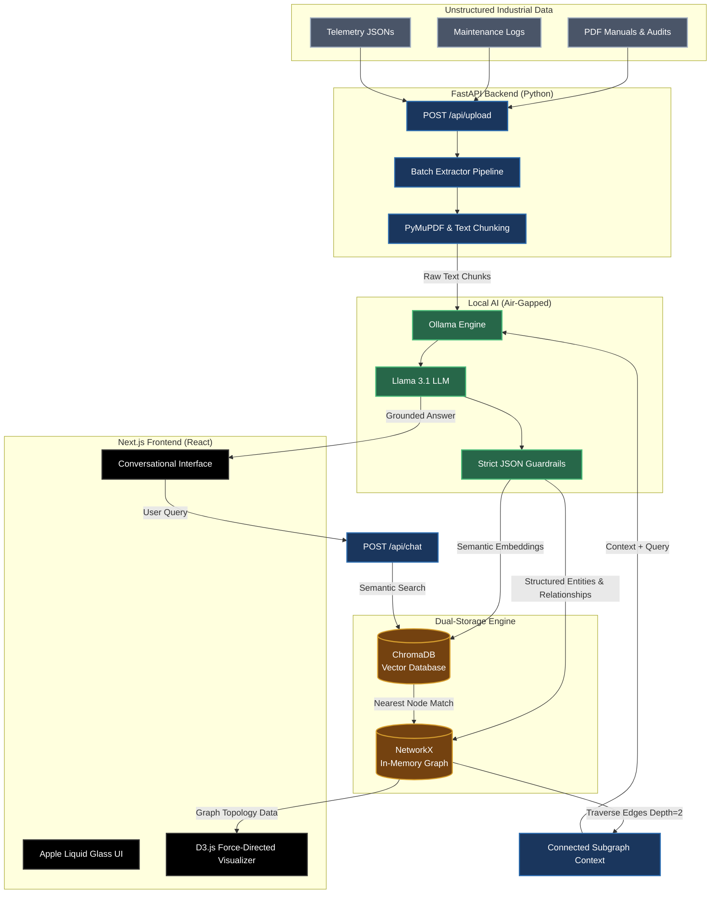

# GraphRAG Brain: Architecture Diagram

This diagram outlines the complete end-to-end data flow and system architecture for GraphRAG Brain, from raw data ingestion to the final user interface.

### Flow Breakdown:
1. **Ingestion:** Raw files (PDFs, TXTs, JSONs) are uploaded via the Next.js frontend to the FastAPI backend.
2. **Extraction:** The `Batch Extractor` slices the text and passes it to the **Local AI Engine** (Llama 3.1 via Ollama).
3. **Structuring:** The LLM is forced by strict prompts to output a JSON contract of Entities and Relationships, which are then saved to **NetworkX** (for graph topology) and **ChromaDB** (for semantic vector search).
4. **Retrieval (RAG):** When a user asks a question, the backend queries ChromaDB for the closest node, then uses NetworkX to pull all connected neighboring nodes.
5. **Generation:** That specific sub-graph is passed back to Llama 3.1 to generate a highly accurate, hallucination-free answer, which is streamed back to the **Apple Liquid Glass UI**.
